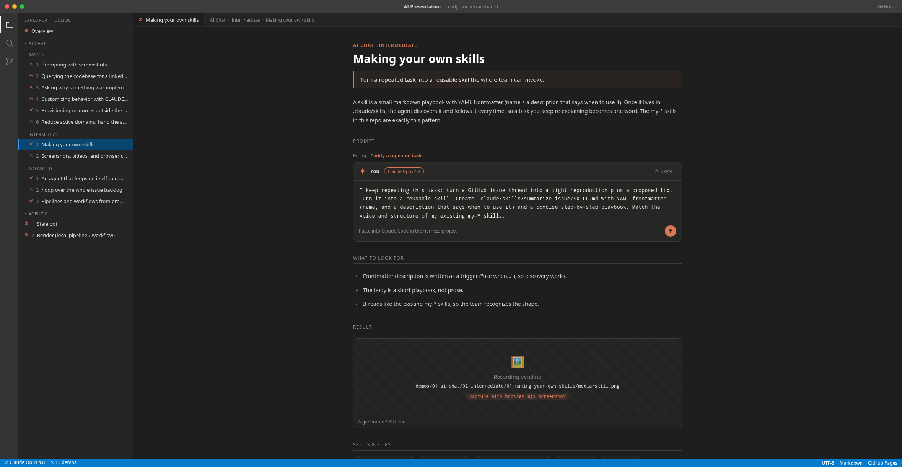

# AI Presentation - Rancher / Dashboard

Prompts, skills, CLAUDE.md examples, and demos that show practical ways to fold AI
into a Rancher / Dashboard workflow. Built to level-set the team on methods that
actually help day to day.

- **Model:** every prompt here is written for and tested with **Claude Opus 4.8**.
- **Live site:** a presentable, VSCode-themed page renders every demo with its prompt
  shown in a Claude chat box. See [Viewing the site](#viewing-the-site).
- **Hosted at:** <https://github.com/codyrancher/ai-shared> (GitHub Pages).

> Status: scaffolding. Every demo has its prompt, notes, and support files. The
> screenshots/videos are placeholders (marked "pending") until captured. See
> [Capturing media](#capturing-media).




## The 1:1 framing

- Everyone is using AI.
- Most people have found small niches in their existing workflow to inject AI.
- Some have not tried the current SOTA models (Claude Opus 4.8 / Fable, OpenAI GPT
  5.5). If you have been disappointed before, it is worth trying one again.

## Demos

### AI Chat › Basics
_Basic in the sense that many already use variations of these. Nice to run inside a
container or VM so the agent can work unsupervised._

1. [Prompting with screenshots](demos/01-ai-chat/01-basics/01-screenshot-prompting/) - text sharing + spatial awareness.
2. [Querying the codebase for a linked report](demos/01-ai-chat/01-basics/02-codebase-query-report/) - every claim links to file:line.
3. [Why something was implemented a certain way](demos/01-ai-chat/01-basics/03-why-was-it-implemented/) - recover reasoning from history.
4. [Customizing behavior with CLAUDE.md](demos/01-ai-chat/01-basics/04-customize-with-claude-md/) - a few lines change behavior; then provision in-cluster.
5. [Provisioning an OIDC provider outside the cluster](demos/01-ai-chat/01-basics/05-provision-oidc-outside-cluster/) - stand up Dex, wire Rancher auth.
6. [Reduce active domains, hand the agent a toolbelt](demos/01-ai-chat/01-basics/06-reduce-domains-more-tools/) - the general approach.

### AI Chat › Intermediate
1. [Making your own skills](demos/01-ai-chat/02-intermediate/01-making-your-own-skills/) - codify a repeated task.
2. [Screenshots, videos, browser control from the CLI](demos/01-ai-chat/02-intermediate/02-browser-skills-live/) - live capture flow.

### AI Chat › Advanced
1. [An agent that loops on itself to resolve an issue](demos/01-ai-chat/03-advanced/01-agent-loop-resolve-issue/) - reproduce → fix → verify → commit.
2. [/loop over the whole issue backlog](demos/01-ai-chat/03-advanced/02-loop-analyze-issues/) - hotspots + duplicate clusters.
3. [Pipelines from prompts alone (zero code)](demos/01-ai-chat/03-advanced/03-prompt-only-pipelines/) - fan-out, verify, synthesize.

### Agentic
1. [Stale bot](demos/02-agentic/01-stale-bot/) - a tiny scheduled agent that warns and closes stale issues.
2. [Bender (local pipeline / workflow)](demos/02-agentic/02-bender/) - solve issues e2e, harvest reusable prompts/skills.

## Repository layout

```
presentation/
├── index.html              # the live site (GitHub Pages entry point)
├── assets/
│   ├── styles.css          # VSCode-dark theme + Claude chat box
│   ├── app.js              # renders the site from demos.js
│   └── demos.js            # single source of truth: metadata + prompts
├── demos/
│   ├── 01-ai-chat/{01-basics,02-intermediate,03-advanced}/NN-slug/
│   └── 02-agentic/{01-stale-bot,02-bender}/
│       └── each demo: README.md · prompt.md · files/ · media/
├── OUTLINE.md              # the source talk outline
└── README.md
```

Each demo folder is self-contained:

- `README.md` - what the demo shows, the prompt, what to look for, the result.
- `prompt.md` - the exact prompt(s) to paste, plus notes.
- `files/` - supporting artifacts (example CLAUDE.md, example skill, sample output).
- `media/` - screenshots and videos of the result (pending until captured).

## Viewing the site

The site is plain HTML/CSS/JS with no build step. It loads `assets/demos.js` via a
script tag (no `fetch`), so it works both from GitHub Pages and straight off disk.

**Locally:**

```bash
# from this directory
python3 -m http.server 8080
# then open http://localhost:8080
```

(Opening `index.html` directly with `file://` also works; a local server just makes
media paths behave exactly like production.)

**GitHub Pages:** in the `codyrancher/ai-shared` repo, Settings → Pages → Deploy from
a branch → `main` / `/ (root)`. The `.nojekyll` file makes Pages serve everything
as-is. The site then lives at the repo's Pages URL, entry point `index.html`.

## Capturing media

Media is intentionally pending. The site shows a labeled placeholder for each one,
noting which tool to use. To fill them in:

- **Videos:** use the `my-browser-record-video` skill (iterate → script → record a
  clean take). Run `wait-for-sidecars browser` first.
- **Screenshots:** `node /workspace/browser.mjs screenshot <url> <out.png>`.
- **Comparisons:** the `my-browser-screenshot-comparison` skill (master vs branch,
  changed element boxed).
- **Scrub IPs** from any recording with `my-video-censor-ip` before publishing.

Drop the file into the demo's `media/` folder using the filename shown in the
placeholder, then flip that entry's `pending` flag to `false` in `assets/demos.js`.

## Editing / adding a demo

`assets/demos.js` drives the site. To change a prompt, description, or media entry,
edit that demo's object there (and mirror the prompt into the demo's `prompt.md` so
the repo reader and the site agree). To add a demo, add a folder under `demos/` and a
matching object under the right section/group in `demos.js`.
