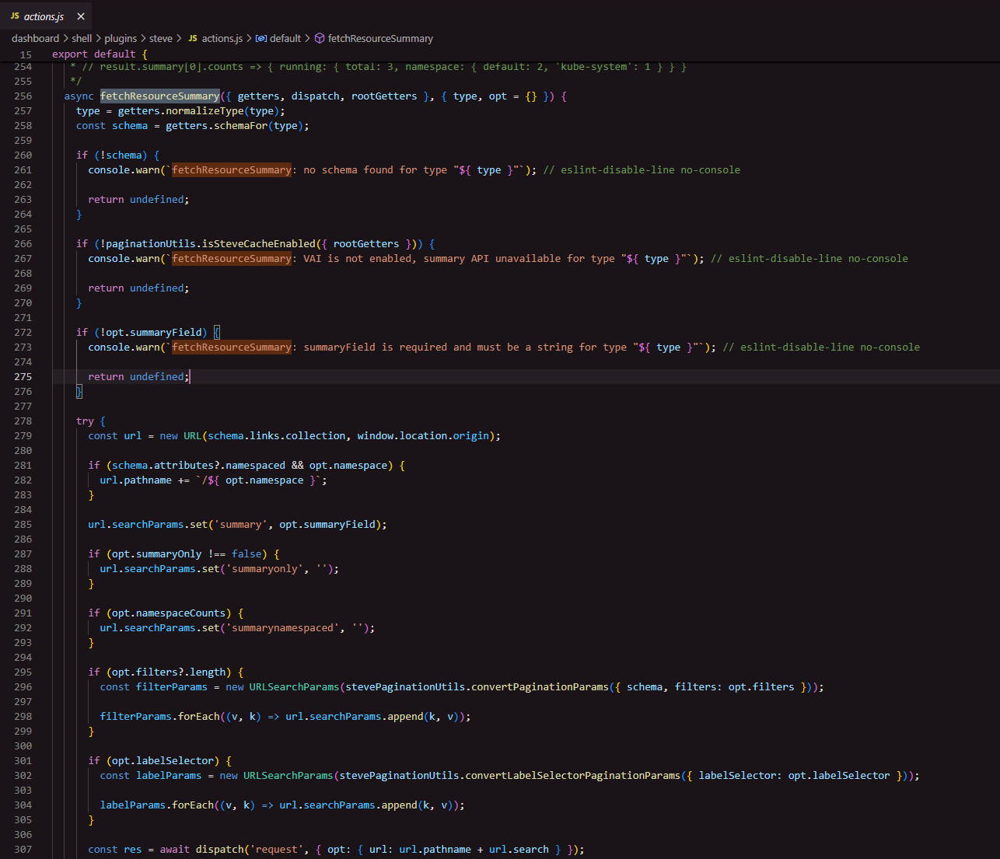

# Codebase Queries

> **AI Chat > Basics** demo in [AI Shared](../../../../README.md).

**Why:** Onboard onto an unfamiliar area in minutes instead of grepping around for an hour, with links you can jump straight into.

## Explain a selected method

**Why:** Understand an unfamiliar function and every path that reaches it, without reading the file or chasing the call sites yourself.

```
Can you explain [the selected method] and describe how it's used?
```

**Result:** [example result](files/explain-method.md)

## Trace a data flow

**Why:** See exactly how a request moves through the system, from input to database to response, without stepping through it in a debugger.

```
Map the data flow for [the current selection]. After mapping it create a data flow diagram.
```

**Result:** [Data flow diagram](files/data-flow-diagram.html)

## Exploring the Backend

**Why:** A quick way to trace from the UI to the backend

```
Can you review the function in the screenshot and link to me where in https://github.com/rancher/rancher the specific summary request is served/implemented?
```



**Result:** [example result](files/cross-repo-lookup.md)

## Fuzzy Code Search

**Why:** Quickly find things across the codebase even if it's named inconsistently.

```
Can you find all instantiations of the RcButton component in our code base? Please provide a table with links to the lines.
```

**Result:** [example result](files/rcbutton.md)
