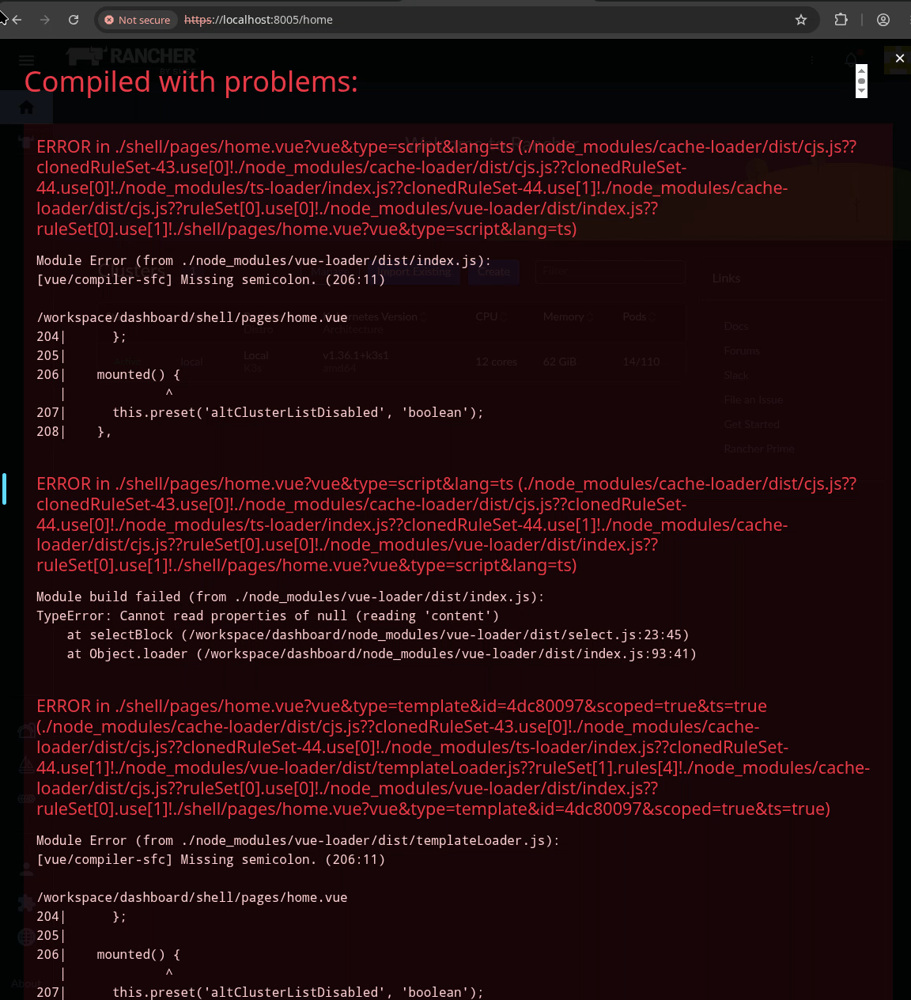
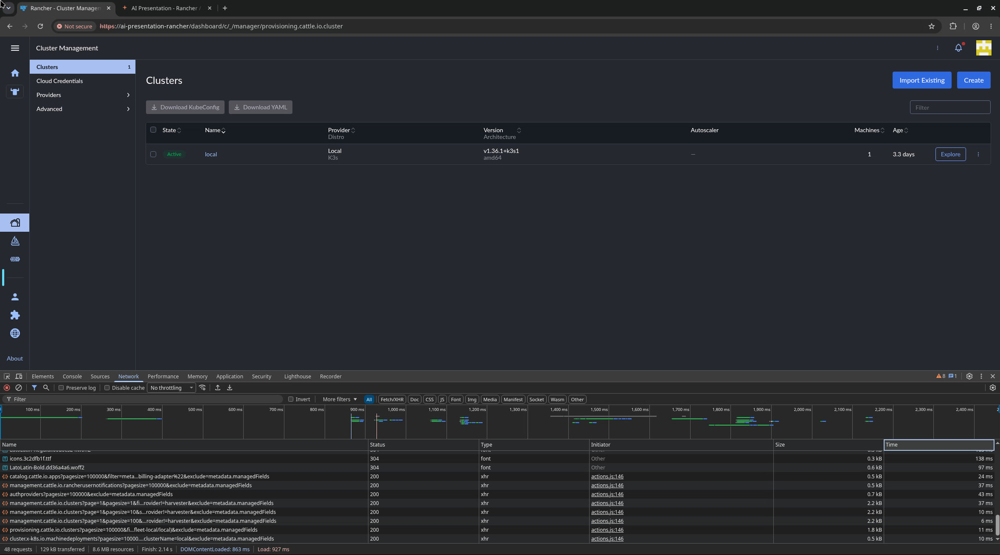

# Screenshot Prompting

> **AI Chat > Basics** demo in [AI Shared](../../../../README.md).

**Why:** Paste a picture instead of retyping or reformatting what is on your screen, and point at the UI instead of describing it in words.

## Quick text sharing

**Why:** Saves the tedium of selecting, copying, and reformatting an error or stack trace. The picture carries the text for you.

```
Can you fix this compiler error?
```



**Result:** [example result](files/compiler-error-fix.md)

## Visual Understanding

**Why:** The models may surprise you with how much they can derive from a screenshot

```
Review the screenshot and tell me the following:
- What host was loaded?
- How long from the first request to the response of the last request elapsed?
- What vue component rendered the list page?
- What's does the text read in the bottom left corner of the page that's a link?
- Are there any console messages visible right now?
```



**Result:** [example result](files/screenshot-analysis.md)

## Notes

- Paste images directly into Claude Code (drag/drop or clipboard). No need to transcribe text out of them first.
- It reads fine detail: the URL bar, the "Finish: 2.14 s" metric in the Network status bar, and the "About" link at the bottom of the sidebar.
- Note answer 3. It says the Vue component is "not derivable from the screenshot alone" and separates what it can see from what it knows from the codebase. Asking several questions at once is a cheap way to find out where that line falls.
