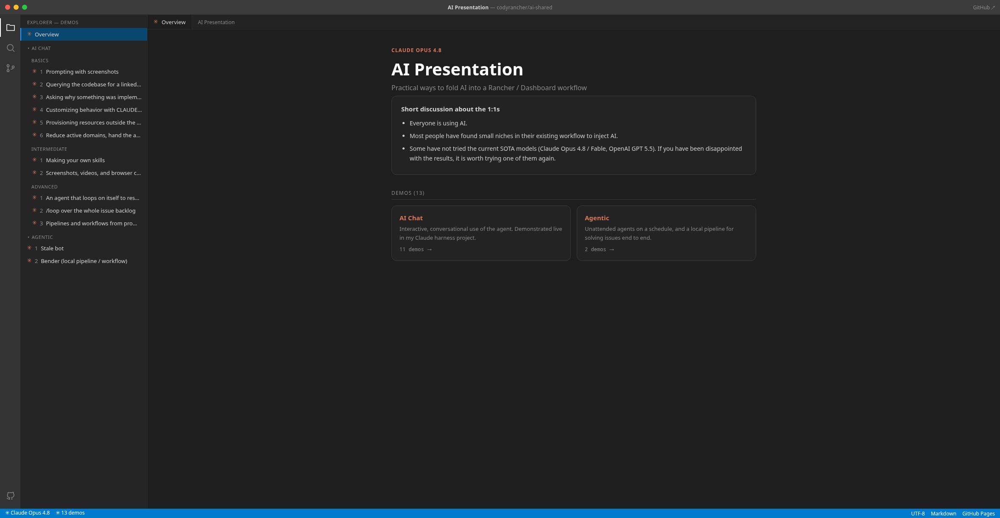

# Screenshot Prompting

> **AI Chat > Basics** demo in [AI Shared](../../../../README.md).

**Why:** Paste a picture instead of retyping or reformatting what is on your screen, and point at the UI instead of describing it in words.

## Quick text sharing

**Why:** Saves the tedium of selecting, copying, and reformatting an error or stack trace. The picture carries the text for you.

```
Can you fix this compiler error?
```


**Result:** [example result](files/compiler-error-fix.md)

## Spatial awareness

**Why:** Faster than writing paragraphs about a layout bug. You point at the region and the agent sees where things sit.

```
The control I circled in red overlaps the search box on narrow viewports. Using the layout you can see in the screenshot, find the Vue component that renders this area and propose a CSS fix that keeps them from colliding below 768px.
```



## Notes

- Paste images directly into Claude Code (drag/drop or clipboard). No need to transcribe text out of them first.
- Annotate before pasting (a red circle, an arrow) when the screen has more than one candidate target.
- Screenshots beat pasted text when layout matters: alignment, overlap, spacing, "which of these three".
