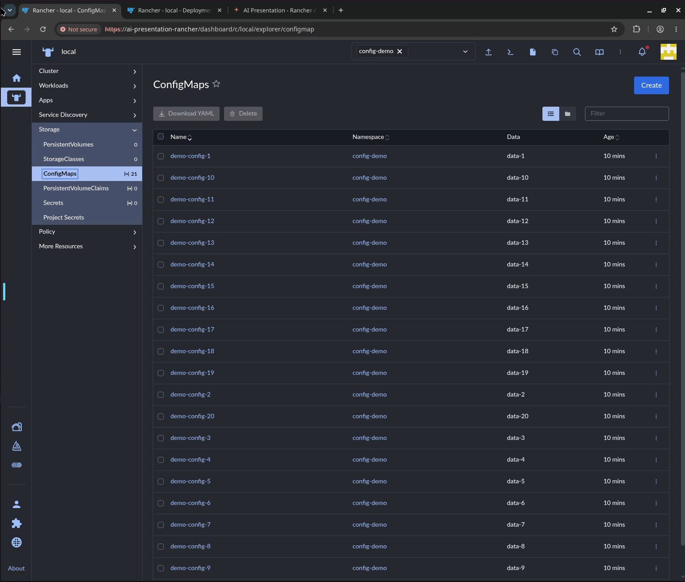
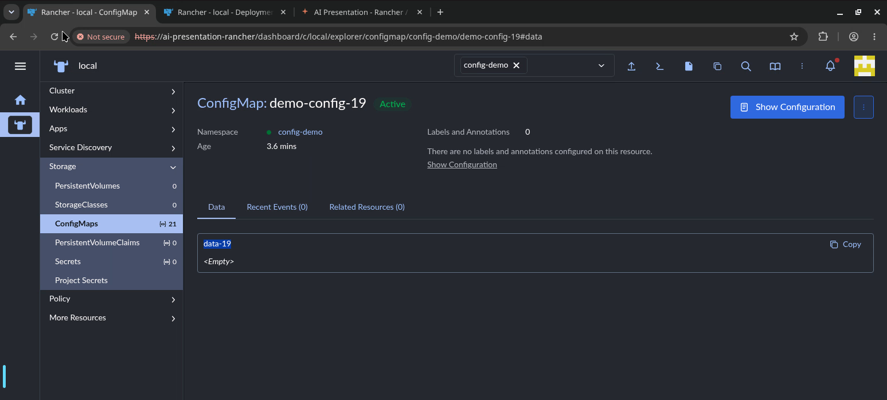

# Customizing behavior with CLAUDE.md

> **AI Chat > Basics** demo in [AI Shared](../../../../README.md).

**Why:** Stop re-explaining the same preferences every session; write the rule once and it sticks.

## Shape behavior

**Why:** Never type "run lint first" or "no em dashes" again. Set it once and every reply obeys.

```
Add two rules to CLAUDE.md: never use em dashes in any output, and always run yarn lint before you tell me a change is done. Then show me the diff.
```

## Provision in-cluster resources

**Why:** Describe 20 near-identical resources in one sentence instead of scripting a loop or running kubectl 20 times.

**Files:** [CLAUDE.md](files/CLAUDE.md)

```
Please create 20 config-maps in the rancher instance.
- They should be named `demo-config-${n}`
- They should have data `data-${n}`.
- Put them all in the `config-demo` namespace
```

**Result:**



## Notes

- CLAUDE.md is loaded at the start of every session, so rules stick without re-prompting.
- Keep rules imperative and testable ("always run X", "never do Y"), so you can see them take effect immediately.
- The keyword-to-kubectl rule is the bridge into demo 5: once the agent can act on the cluster from a phrase, it can also provision the infrastructure around it.
- See [`files/CLAUDE.md`](./files/CLAUDE.md) for a ready-to-adapt block.
