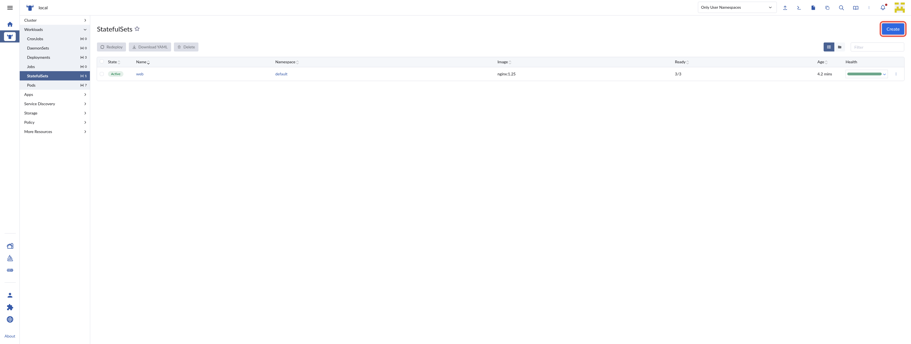
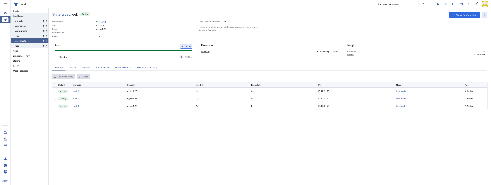

# Browser Control

> **AI Chat > Advanced** demo in [AI Shared](../../../../README.md).

**Why:** Turn "reproduce this and film it" into one instruction, and batch it across the backlog while you work on something else.

## Take a screenshot

**Why:** Grab the current state of a page without leaving the terminal or wiring up any tooling.

**Files:** [browser.mjs](files/browser.mjs)

```
Take a screenshot of a statefulset list and detail page.
- Highlight the create button on the list page
- Name them stateful-list, stateful-detail.
```

**Result:**
[example result](files/statefulset-screenshots.md)



## Quick Comparisons for Review

**Why:** Hand reviewers a labeled before/after of every visual change, instead of making them check out the branch and click through it themselves.

**Files:** [/my-browser-screenshot-comparison](files/my-browser-screenshot-comparison.md) [my-browser-screenshot-comparison.mjs](files/my-browser-screenshot-comparison.mjs) [browser.mjs](files/browser.mjs)

```
Find all of the changes that we've made in this branch and use /my-browser-screenshot-comparison to take comparison screenshots of each
```

**Result:** [Comparison screenshots posted on rancher/dashboard#17178](https://github.com/rancher/dashboard/pull/17178#issuecomment-4380619058)

## Record a video

**Why:** Capture a short screen recording of a flow, hands-free and in one clean take.

**Files:** [/my-browser-record-video](files/my-browser-record-video.md) [browser.mjs](files/browser.mjs) [record-template.mjs](files/record-template.mjs) [overlay.mjs](files/overlay.mjs)

```
/my-browser-record-video of the admin user logging into https://ai-presentation-rancher/dashboard, navigating to the auth page and creating a new standard user.
```

**Result:**


## Reproduce an issue

**Why:** Verify a bug report with a recorded video as an artifact to help the reproduction process.

**Files:** [/my-browser-record-video](files/my-browser-record-video.md) [browser.mjs](files/browser.mjs) [record-template.mjs](files/record-template.mjs) [overlay.mjs](files/overlay.mjs)

```
Can you reproduce https://github.com/rancher/dashboard/issues/15249? Create a list of steps/scripts to reproduce the issue and then /my-browser-record-video.
```

**Result:**
[example result](files/repro-15249.md)


## Skills & files

- `my-browser-record-video`
- `my-video-censor-ip`

## Notes

- The record skill iterates first, records second, so the final video has no "what do I click next" pauses. That is the whole trick to a clean take.
- Always `wait-for-sidecars browser` before recording; the browser sidecar takes several seconds to boot and CDP refuses connections until it is up.
- Batch the record prompt across a list of stale issues to find ones already fixed, or to attach a ready-made repro that lowers the bar for whoever picks the issue up.
- If the recording shows a dev IP in the URL bar or a form, scrub it with `my-video-censor-ip` before posting.
