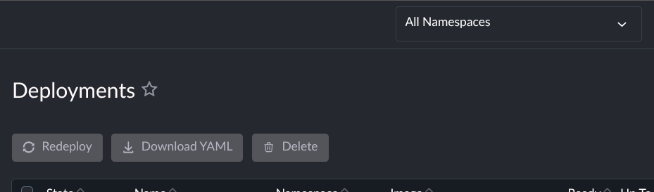
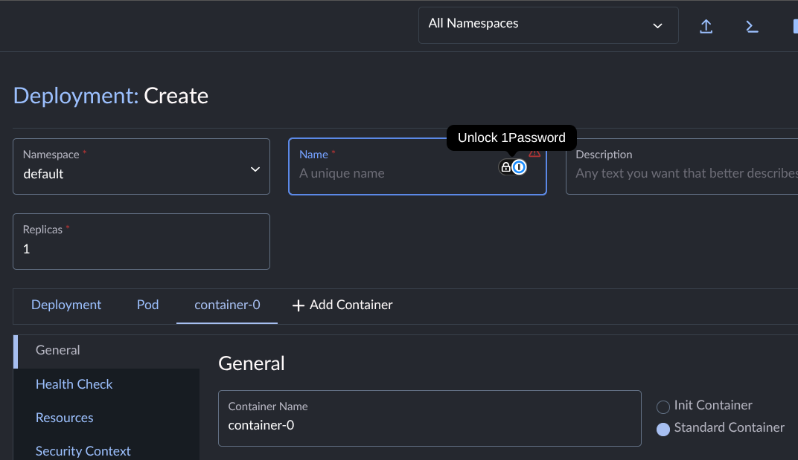
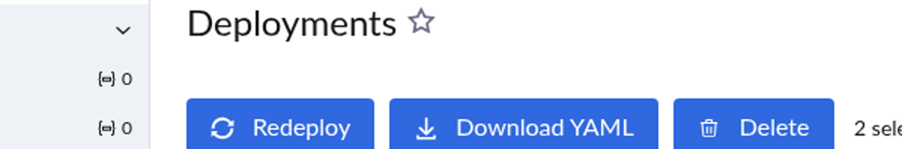
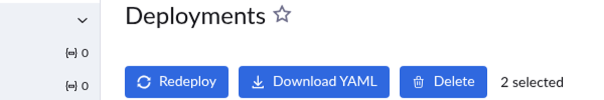

# Increase Agent Scope

> **AI Chat > Advanced** demo in [AI Shared](../../../../README.md).

**Why:** Hand the agent a job that spans the whole repo, its history, or a dataset far bigger than one context.

## Bisect the regression

**Why:** Finds the commit that broke it by actually checking out each one and looking, instead of you doing it by hand.

```
We had an issue reported as seen in the two screenshots around alignment. Can you bisect the codebase to find the initial commit and the very briefly explain what you thing the cause is?

If it's not obvious from the original report they're referring to the button icons not aligning with text in the buttons. You can see it in the screenshot. Also, they're looking at the Deployments list page if that helps narrow it down.

While going through the commits use the dev server as you switch the base of the code and take screenshots to visually verify when the issue is no longer present.
```




**Result:** [example result](files/bisect-result.md)

## Make it show its work

**Why:** The agent claimed it verified the commits. Ask for the evidence and you get the proof, or you find out it never did it.

```
Where are the screenshots, I also don't see any evidence that you checked out the commits to verify.
```

**Result:**
[example result](files/bisect-proof.md)




## Analyze a large dataset

**Why:** Turns a 1,000-issue backlog into a ranked report of duplicate clusters and code hot-spots, without reading any of it yourself.

**Files:** [analysis.prompt.md](files/analysis.prompt.md)

```
/loop 1h @analysis.prompt.md
```

**Result:** [example result](files/analysis-final.md)

## Notes

- The load-bearing clause in the bisect prompt is "switch the base of the code and take screenshots to visually verify". Without it the agent reasons about the diff and guesses; with it, it has to look.
- Even so, the first answer asserted the screenshots existed without showing them. Asking "where are the screenshots" is what turned a claim into evidence (the reflog is the agent proving it really checked the commits out).
- Cropping to the changed element is what makes the regression obvious. The full-page screenshots looked nearly identical.
- `/loop 1h` re-runs the prompt on a fresh context on an interval. That is the point: 1,000+ rows would blow one context, so each pass takes the next batch (100 here) and the analysis stays sharp to the end.
- The looped prompt lives in its own file (`@analysis.prompt.md`), so every pass replays the exact same instruction. Results are written back to the source DB, which makes the run resumable.
