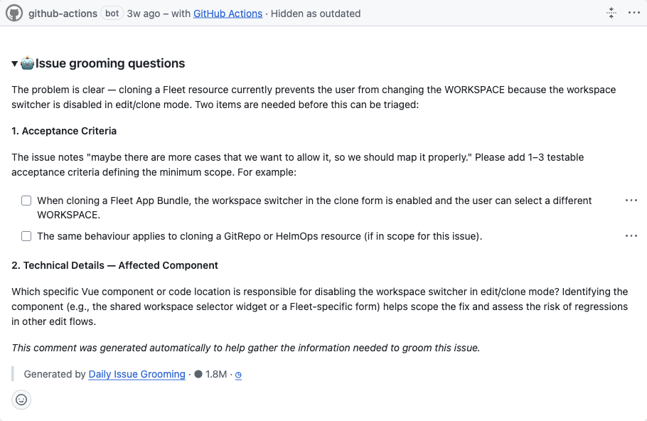
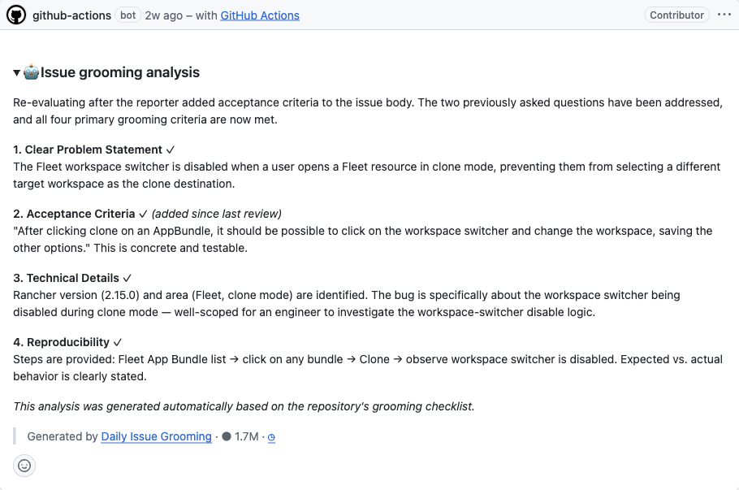

# Daily Issue Grooming

> **Agentic > Scheduled repo bots** demo in [AI Shared](../../../../README.md).

**Why:** Make issues actually workable *before* a human picks them up. A daily agent checks open issues against a grooming checklist, asks for exactly what's missing, and re-evaluates once the reporter fills the gaps — so an engineer inherits a complete, scoped issue instead of a vague one.

## The scheduled grooming workflow

**Why:** A consistent, written grooming standard applied to every issue every day beats ad-hoc grooming in meetings — and the back-and-forth happens on the issue, asynchronously, without a human driving it.

```
# Daily Issue Grooming — scheduled agentic workflow
# .github/workflows/daily-issue-grooming.md

Runs daily. For each open issue not yet groomed, score it against the grooming
checklist:
  1. Clear problem statement
  2. Acceptance criteria (1–3 testable, minimum-scope)
  3. Technical details (the affected component / code location)
  4. Reproducibility (steps, expected vs actual)

If criteria are missing: post a comment asking specific, checkbox-style questions
for only the missing items (e.g. "add 1–3 testable acceptance criteria", "which
Vue component disables the switcher?").

If a previously-questioned issue has since been updated: re-evaluate, mark which
criteria are now met, and note what changed. Label / advance the issue when all
four are satisfied.
```

**Result:** 

**Result:** 

## What to look for

- Two phases on one issue. First a "questions" comment asking only for the missing pieces; later an "analysis" comment that re-checks after the reporter responds and confirms which criteria are now met.
- A fixed, four-point standard. Every issue is judged the same way — problem statement, acceptance criteria, technical details, reproducibility — so grooming quality doesn't depend on who's on rotation.
- Minimum-scope pressure. It nudges reporters toward 1–3 concrete, testable criteria instead of open-ended wishlists, which keeps issues estimable.
- Estimated time saved: grooming a backlog by hand is recurring PM/lead time and slow reporter round-trips; here the round-trip is automated and asynchronous, and issues land engineer-ready. Full breakdown in the impact.md file above.

## Skills & files

- [`impact.md`](files/impact.md)

## Notes

- Real workflow: [`daily-issue-grooming.md`](https://github.com/rancher/dashboard/blob/master/.github/workflows/daily-issue-grooming.md) in rancher/dashboard.
- Grooming ≠ triage. This makes the issue *complete and scoped*; the Issue Triage bot then *diagnoses* it. They compose: groom first, triage the well-formed result.
- The value is consistency + async round-trips: the standard is applied identically every day, and the reporter conversation happens without tying up a human.
- Screenshots to add: `media/grooming-questions.png`, `media/grooming-analysis.png`.
