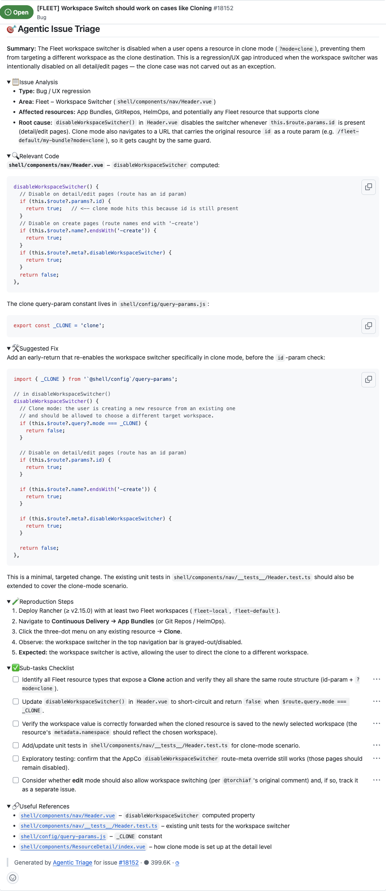

# Agentic Issue Triage

> **Agentic > Scheduled repo bots** demo in [AI Shared](../../../../README.md).

**Why:** Give whoever picks up a bug a running start. The agent reads the actual code, pins the root cause to a file and line, explains the mechanism, and proposes a concrete fix (with options) plus repro steps — so triage starts from an analysis instead of a cold report.

## The triage workflow

**Why:** The expensive part of triage isn't reading the report — it's opening the codebase and finding *why* it breaks. An agent with repo access can do that pass automatically and leave the findings on the issue.

```
# Agentic Issue Triage — scheduled agentic workflow

For each new/untriaged bug issue:
  1. Summarize the problem in one or two lines.
  2. Root-cause it IN THE CODE: find the responsible component and line, and
     explain the mechanism. Compare against working analogues where useful
     (e.g. why GKE's defaultCluster lacks importedConfig that AKS/EKS have).
  3. Propose a fix: one or more concrete options, marking a preferred one and
     why (e.g. "Option A — matches the AKS pattern: add importedConfig: {}").
  4. Give reproduction steps and expected vs actual behavior.
  5. Post it as a triage comment with the file/line references.
```

**Result:** 

## What to look for

- Root cause with a file and line, not a guess. The example lands on pkg/gke/components/CruGKE.vue and explains exactly why a new provisioning cluster hits a TypeError the import path doesn't.
- Reasoning by analogy across the codebase. It contrasts GKE against the AKS/EKS forms that already work — the same move a senior engineer makes — to both explain the bug and justify the fix.
- A concrete, ranked fix. Not "investigate this" but "Option A (preferred): add importedConfig: {}", so the engineer starts from a proposal.
- Directional, not infallible. Some triages will be off, but even a wrong-but-specific analysis points the investigation somewhere. Estimated time saved: the code-reading pass that usually precedes any fix is done up front — full breakdown in the impact.md file above.

## Skills & files

- [`impact.md`](files/impact.md)

## Notes

- Triage ≠ grooming. Grooming makes the issue *complete*; triage *diagnoses* it and suggests a fix. Groom first, triage the well-formed issue.
- The file/line references are what make it actionable — they turn a report into a starting point in the code, and let a reviewer sanity-check the analysis fast.
- Treat the suggested fix as a hypothesis to verify, not a patch to merge blind; the win is the head start, not blind trust.
- Screenshot to add: `media/issue-triage.png`.
