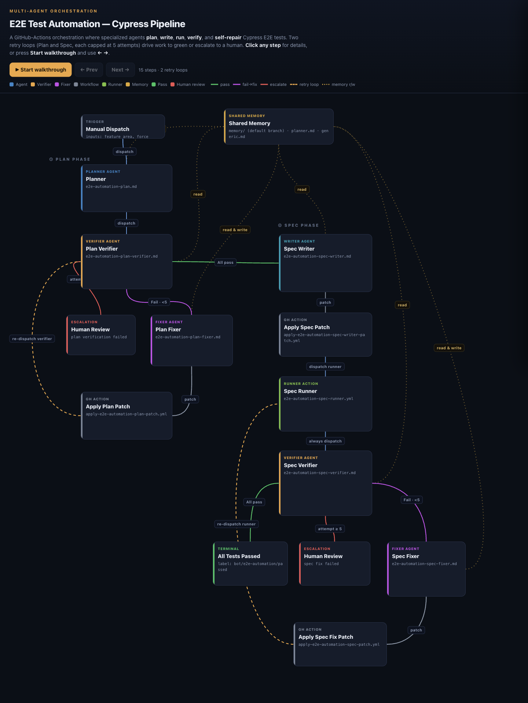

# E2E Test Automation (multi-agent)

> **Agentic > Multi-agent orchestration** demo in [AI Shared](../../../../README.md).

**Why:** Produce real, passing Cypress E2E coverage for a feature end-to-end — planned, written, run, and fixed — by an orchestration of specialized agents that grade each other, so it converges on a good test instead of looping on a bad one.

## The orchestration: plan first, then execute

**Why:** Splitting the work across single-purpose agents — and pairing every *doer* with a *verifier* that grades and gates — is what stops the run from spiraling into a loop of confident-but-wrong output.

```
Orchestrate an E2E test build as a pipeline of specialized agents over a shared
memory branch. Two phases, each an execute→verify→(fix|advance) loop:

PHASE 1 — PLAN (no code execution)
  planner    → read learnings, analyze the codebase, identify untested features,
               write a test plan, open a draft PR
  verifier   → check plan structure, verify selectors exist in source, check
               coverage, grade it. All pass → phase 2. Fail → fixer (max 5
               attempts, then escalate to a human).

PHASE 2 — SPEC
  writer     → turn the plan into a Cypress spec + page objects
  runner     → start Rancher + charts + dev UI, run Cypress, upload artifacts
  verifier   → download artifacts, parse the Cypress log, decide pass/fail, grade,
               comment on the PR. All pass → label bot/e2e-automation/passed.
               Fail → fixer (max 5 attempts) → re-run.

Every agent reads/writes shared learnings so later runs start smarter. Bound each
loop with an attempt cap that escalates to Human Review instead of spinning.
```

**Result:** 

## What to look for

- Plan before execution. Phase 1 validates the test plan (selectors exist, coverage is real) before a single spec is written. Cheap to fix a bad plan; expensive to debug a bad spec built on one.
- Doer + verifier, everywhere. Each stage that produces something is followed by one that grades it and either advances or sends it back to a fixer. The verifier is what prevents the classic "agent loops on its own failure" death spiral.
- Bounded loops. Attempt caps (about 5) hand off to Human Review instead of burning cycles forever.
- Shared memory compounds. Learnings persist on a branch across runs, so each new test starts from what earlier ones discovered.
- Cheap enough to prove the point. This ran as a GitHub Actions orchestration; the whole appeal was how little it cost per full test relative to the engineering time it replaces. Numbers and the example run (rancher-ai-ui#228) are in the impact.md file above.

## Skills & files

- [`impact.md`](files/impact.md)

## Notes

- This is the multi-agent counterpart to the local **Bender** pipeline: same "solve it e2e, verify each stage" philosophy, run as a cloud orchestration instead of a local one.
- The verify-and-grade step is the load-bearing idea. Without it a single agent will keep "fixing" toward a wrong target; the grader defines *done* and refuses to advance until it's met.
- The two-phase split (plan, then spec) is the other big lever — it front-loads the cheap checks (do these selectors even exist?) before any expensive execution.
- Screenshot to add: `media/orchestration-flow.png` (the pipeline diagram).
