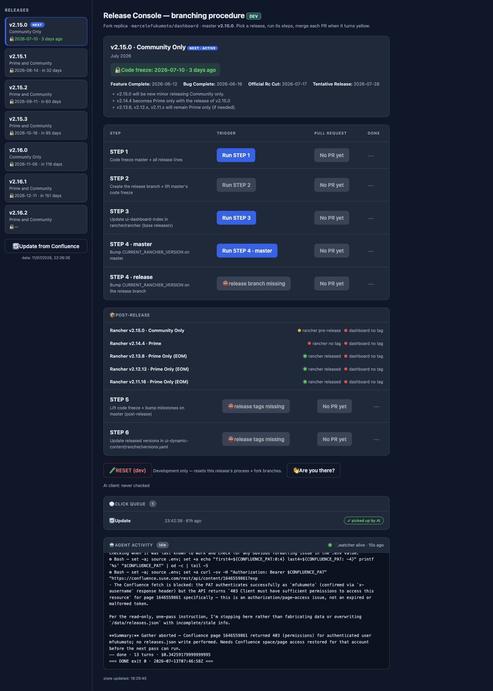

# Release Captaincy Console

> **Agentic > AI-powered tooling** demo in [AI Shared](../../../../README.md).

**Why:** Turn the manual, checklist-heavy release-captain rotation into a dashboard of buttons — each one triggers an agent to perform a release step — and ask the AI for analysis or recovery on demand, because the process itself lives in prompts.

## A process made of buttons that trigger agents

**Why:** Encoding each release step as an agent action (not a runbook a human follows) means the process is executable, inspectable, self-improving, and recoverable — the prompts *are* the source of truth.

```
Build a Release Console: a dashboard of the release lifecycle where each step is a
button that dispatches an agent to do the work, and the page shows live status.

Steps as agent actions, e.g.:
  1. Code freeze master + all release lines
  2. Create the release branch, lift master's freeze
  3. Update ui-dashboard-index in rancher/rancher (base release/v)
  4. Bump CURRENT_RANCHER_VERSION (master + release branch)
  5. Post-release: lift freeze + bump milestones on master

Each button: run the step, open the resulting PR, and report status back on the
board. Also expose free-form asks — "analyze what's blocking v2.15.0", "pull the
post-release tag status", "recover step 3, here's what went wrong" — answered
against the same live data and the step prompts.
```

**Result:** 

## What to look for

- A process, not a script. Deterministic automation would need every branch and edge case coded up front. Here the volume and variety are handled by an agent, and you can ask for more — extra data, a new analysis, a recovery action — without shipping code.
- Self-improving and maintainable. Because steps are prompts, the executor can suggest and apply improvements to the process itself, and record more data as it goes. Maintenance is editing English, not refactoring a pipeline.
- Recovery is cheap. When something goes wrong, the step's prompt is right there — hand the AI the failure context and it can reason about how to recover, instead of you reverse-engineering a runbook.
- Estimated time saved: release captaincy is otherwise about a day of careful, error-prone manual git/PR/version work per release, plus the cost of onboarding each rotating captain. Buttons and on-demand analysis cut it to trigger-and-review. Full breakdown in the impact.md file above.

## Skills & files

- [`impact.md`](files/impact.md)

## Notes

- The pitch isn't "determinism" — it's *volume and flexibility*. You trade a rigid, fully-coded pipeline for an agent that does a lot, feeds results back into the process, and can be asked for more at any time.
- Keeping the process in prompts is what makes it recoverable and shareable: any captain (or the AI) can read exactly what a step does and how to undo it.
- Screenshot to add: `media/release-console.png` (the dashboard).
