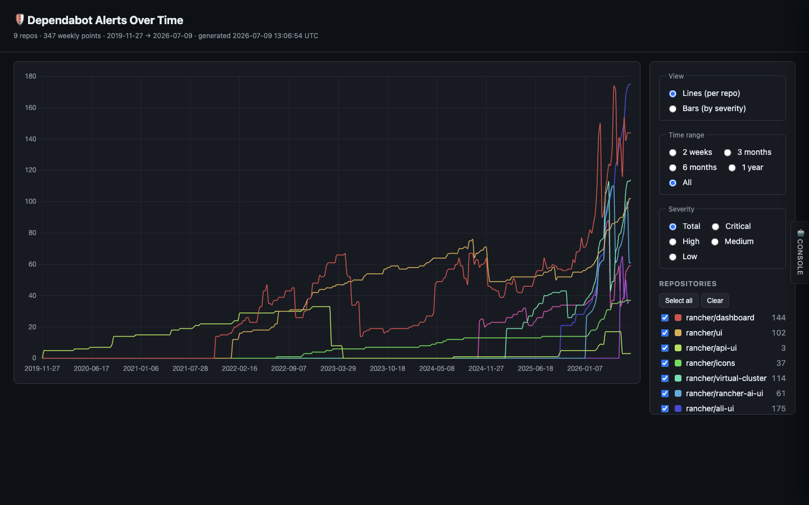

# Security Alert Dashboards

> **Agentic > AI-powered tooling** demo in [AI Shared](../../../../README.md).

**Why:** Give the team real visibility into security-alert trends with a dashboard that AI both *builds* and *feeds* — no bespoke frontend project, and you extend it by asking in plain English.

## "Show me the Dependabot alerts over time"

**Why:** The expensive part of an internal dashboard usually isn't the chart — it's standing up a project to fetch, shape, and render the data. Handing all three to AI collapses that to a request.

```
Build a small dashboard that visualizes our security posture over time.

- Fetch the data: pull Dependabot alerts (open/fixed/dismissed) for rancher/
  dashboard, with dates, severity, and package.
- Shape it however the charts need.
- Render it as a self-contained page: alerts over time, a severity breakdown, and
  the current open backlog.

Then let me extend it by asking — "add mean-time-to-fix by severity", "split by
direct vs transitive", "overlay release dates" — and regenerate.
```

**Result:** 

## What to look for

- AI end-to-end: fetch → shape → render. It's not just drawing a chart from data you prepared — the agent gathers the data and organizes it however the visualization needs.
- Extend by asking. New cut, new metric, new overlay? Describe it and regenerate. There's effectively no boundary and no ticket.
- Cheap to maintain and recover. Because the whole thing is AI-generated, changing it or rebuilding it is another prompt, not a frontend maintenance burden.
- Estimated time saved: a bespoke internal dashboard (data plumbing plus UI) is typically days to stand up and an ongoing maintenance tax; here it's minutes to generate and a sentence to change. Full breakdown in the impact.md file above.

## Skills & files

- [`impact.md`](files/impact.md)

## Notes

- The point of this demo is the *power of letting AI present information*: low friction to show data, and low friction to change what's shown.
- Pairs naturally with the **Dependabot Auto-Fixer** (unattended-loops group): this shows the security-debt trend, that burns it down.
- Screenshot to add: `media/dependabot-alerts.png` (the alerts-over-time chart).
