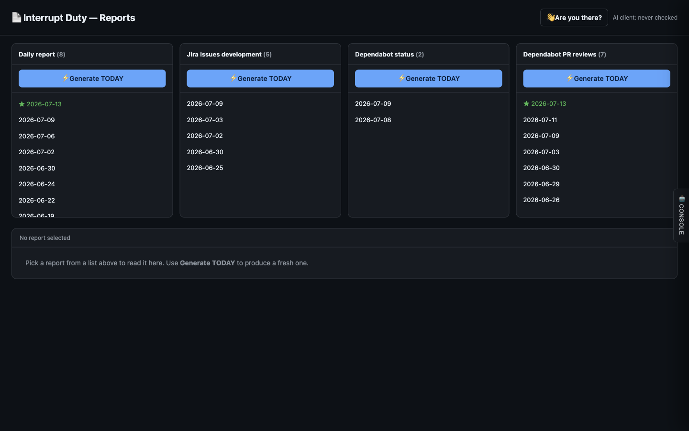

# Interrupt-Duty Reports

> **Agentic > AI-powered tooling** demo in [AI Shared](../../../../README.md).

**Why:** Auto-compile the daily interrupt-duty report — the Jira + GitHub triage summary someone otherwise assembles by hand every morning — from a fixed prompt and a fixed format, so the whole team just reads it.

## A report that generates itself each day

**Why:** The data-gathering and the output format are fixed and reusable; the only variable is plain-English intent, so *any* report you can describe becomes a one-time setup.

```
Generate today's Interrupt Duty report:

- Gather: new/in-triage/waiting Jira issues in development, and GitHub issues
  (new in the last 30 days, open questions, oldest untriaged).
- Rank: the top 3 most urgent, with issue number, one-line summary, age, and why
  it's urgent (no response, oldest in window, etc.).
- Format: a dated Markdown report — "Today's Reminder" counts, then Top 3 Most
  Urgent, then the full lists.
- Save it as daily-report-<date>.md so past days stay browsable.
```

**Result:** 

## What to look for

- Fixed prompt, fixed format, reusable pipeline. The gathering and rendering are set once; every day just re-runs it. Consistency is the feature — the report reads the same whoever's on duty.
- No boundary on what you report. Because the shape is "gather X, rank by Y, render as Z", any new report (different sources, different ranking, different format) is describable in plain English and handed to the same machinery.
- A tab per report type. Daily report, Jira development, Dependabot status and PRs — each is the same pattern pointed at different data, browsable by date.
- Estimated time saved: compiling this by hand is roughly 30–45 min every morning for the person on interrupt duty; automated, it's read-only. Across a rotation that's hours per week reclaimed. Full breakdown in the impact.md file above.

## Skills & files

- [`impact.md`](files/impact.md)

## Notes

- Distinct from the Security Alert Dashboards demo: that's free-form *visualization*; this is a **fixed, repeatable report** — the value is consistency and zero daily effort, not novelty.
- The reusable "gather → rank → render" skeleton is the real asset. New report types cost a sentence, not a project.
- Screenshot to add: `media/reports-console.png` (the reports console).
