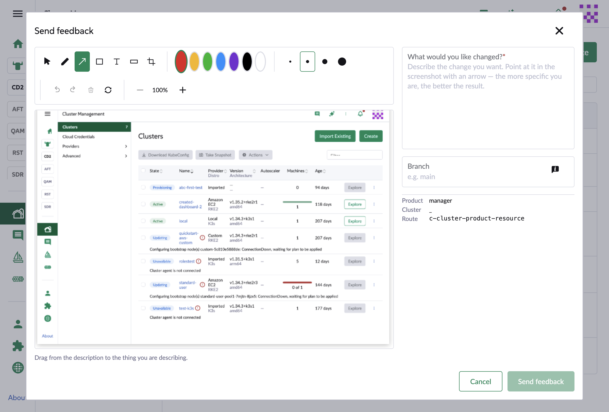
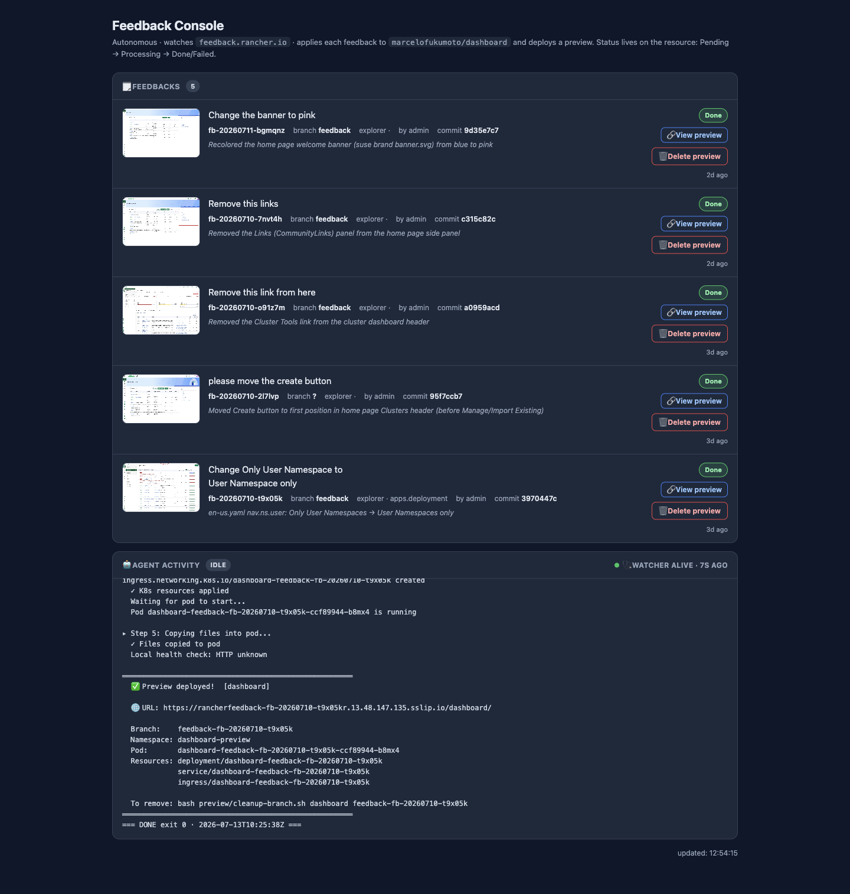

# Screenshot Feedback Agent

> **Agentic > Autonomous build & deploy** demo in [AI Shared](../../../../README.md).

**Why:** Let anyone request a UI change by pointing at a screenshot and describing it — an autonomous agent turns that into a branch, a commit, and a *deployed preview they can click*, with no engineer in the loop for the first pass.

## The capture: point, describe, pick a branch

**Why:** The input is a screenshot with an arrow plus one sentence — the same spatial-prompting trick from the Screenshot Prompting chat demo, but built into the product so non-engineers can use it.

```
Feedback (from the Rancher extension's "Send feedback" panel):
  screenshot:   annotated with an arrow pointing at the target element
  description:  "Remove the Cluster Tools link from the cluster dashboard header"
  branch:       feedback
  context:      product=explorer · cluster=local · route=c-cluster-explorer

→ written as a feedback.rancher.io resource (status: Pending)
```

**Result:** 

## The autonomous watcher

**Why:** It's not scheduled and not chatted at — it watches a Kubernetes resource and reacts, carrying each request all the way to a running preview. The status lives on the resource, so the whole thing is observable and recoverable.

```
# Autonomous feedback watcher
Watch feedback.rancher.io resources. For each new one (status: Pending):
  1. Mark it Processing.
  2. From the annotated screenshot + description + route context, locate the exact
     UI element in marcelofukumoto/dashboard.
  3. Make the change on the feedback's branch and commit.
  4. Deploy a preview environment for that branch.
  5. Mark it Done with the preview URL — or Failed with a concrete reason.

Rule: never guess a change without a verifiable target. A blank/unusable screenshot
or a description that doesn't identify a real element → Fail with the reason, don't
edit a product string on a hunch.

Status on the resource: Pending → Processing → Done / Failed.
```

**Result:** 

## What to look for

- Describe-and-see, no engineer for the first pass. Someone points at the UI and writes a sentence; the agent returns a change running in a real preview env, not a mockup or a diff.
- Autonomous and event-driven. It watches feedback.rancher.io resources — not a cron, not a chat prompt. Status lives on the resource (Pending → Processing → Done/Failed), so it's observable with kubectl and recoverable, with a watcher-alive heartbeat on the console.
- Refuses to guess. The "big test" feedback failed on purpose: the screenshot captured blank (all null bytes), so with no verifiable target the agent declined to edit a real product string and explained exactly why. Honest failure beats a confident wrong change.
- Spatial prompting is the whole input. The arrow on the screenshot plus the route context is what lets it find the exact element — the more specific the point, the better the result.
- One branch and preview per feedback. Each request becomes its own branch, commit, and preview URL, so changes are reviewed running and side by side.
- Estimated time saved: turning "move this / remove that" into something you can actually look at normally needs an engineer to interpret it, branch, implement, and deploy; here the requester self-serves that first pass. Full breakdown in the impact.md file above.

## Skills & files

- [`impact.md`](files/impact.md)

## Notes

- CRD-native by design: modeling feedback as a Kubernetes resource with a status field is what makes the flow observable, retryable, and recoverable — the console is just a view over those resources and the agent's activity log.
- Ties two earlier ideas together: screenshot / spatial prompting (AI Chat › Basics) as the input, and a console-over-agents (Release Captaincy) as the control surface.
- The refuse-to-guess rule is load-bearing — an agent that edits product strings from a blank screenshot is worse than one that fails loudly.
- Screenshots to add: `media/send-feedback.png` (the capture panel), `media/feedback-console.png` (the console).
