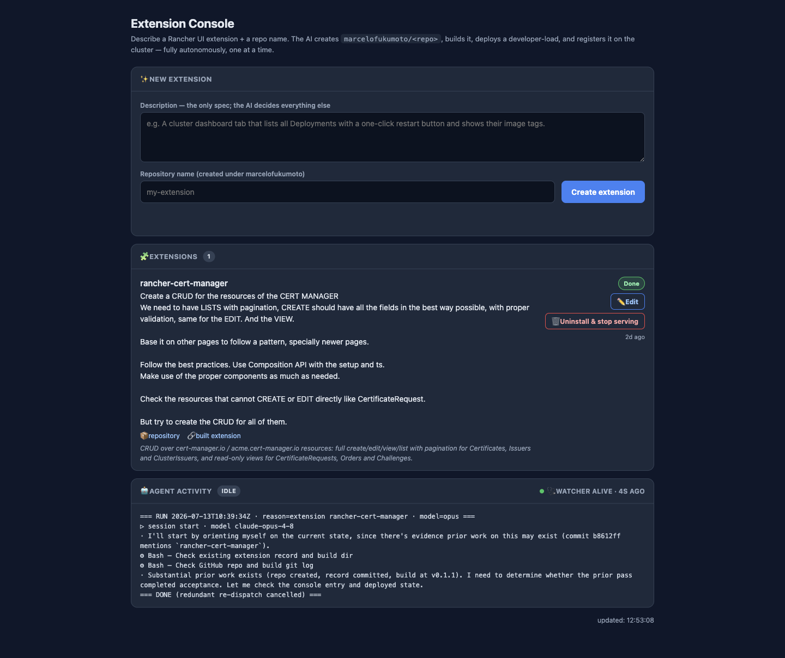
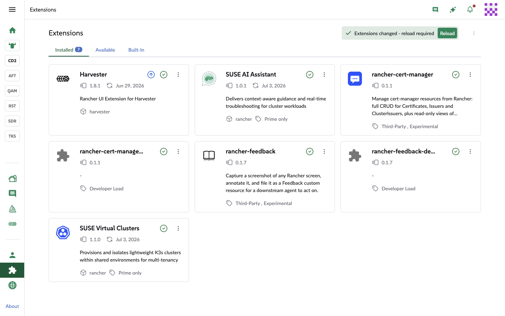

# Extension Console

> **Agentic > Autonomous build & deploy** demo in [AI Shared](../../../../README.md).

**Why:** Describe a Rancher UI extension in plain English and get it *built, deployed to a test cluster, verified in the browser, and registered in Rancher* — the whole extension lifecycle from one description, autonomously.

## The request: a description and a repo name

**Why:** The description is the only spec — intent and constraints. The agent owns every implementation decision (scaffolding, components, structure, validation), the way you'd brief a senior engineer, not write a ticket.

```
Description (the only spec; the AI decides everything else):

  Create a CRUD for the resources of cert-manager.
  - LISTS with pagination; CREATE with all fields done well, proper validation;
    same for EDIT; and a VIEW.
  - Base it on other pages to follow a pattern, especially newer pages.
  - Follow best practices. Use the Composition API with <script setup> and TS.
    Reuse the proper components as much as possible.
  - Handle resources that can't be created/edited directly (e.g. CertificateRequest).
  - Try to create the CRUD for all of them.

Repository name: rancher-cert-manager   (created under marcelofukumoto/)
```

**Result:** 

## Built, deployed, verified, registered

**Why:** It doesn't stop at "it compiled." The agent deploys the extension, drives the running UI with Playwright to confirm it actually works, then registers and persists it — a verifier wired into the pipeline.

```
# Autonomous extension pipeline (one at a time)
For each new extension request (status: Pending):
  1. Create the repo under marcelofukumoto/<repo>.
  2. Build the extension from the description — scaffold, pages, CRUD, validation,
     following existing (newer) patterns; Composition API + <script setup> + TS.
  3. Deploy a developer-load to the test cluster.
  4. Register the extension on the cluster.
  5. Verify with Playwright: drive the real UI and confirm the pages work.
  6. Persist it and mark Done (with repository + built-extension links) — or Failed
     with the reason.

Status on the resource: Pending → Processing → Done / Failed. Watcher alive, serial.
```

**Result:** 

## What to look for

- The description is the only spec. The cert-manager brief is intent and constraints (full CRUD, pagination, validation, Composition API + setup + TS, base on newer pages, handle resources you can't create directly) — the agent decides all the implementation.
- Full lifecycle, unattended. From one sentence: repo created under your org, built, developer-load deployed, registered on the cluster, and persisted — no manual step between "describe" and "use it in Rancher".
- It verifies itself with Playwright. The agent drives the running UI to confirm the extension actually works before calling it Done — a built-in verifier, not just a successful compile.
- It got the hard cases right. Full create/edit/view for Certificates, Issuers, and ClusterIssuers, but read-only views for the controller-managed CertificateRequests, Orders, and Challenges — it respected which resources you can't create directly.
- Autonomous and serialized. It watches for new requests and processes one at a time; status lives on the resource with a watcher-alive heartbeat — the same CRD-native design as the Feedback agent.
- Estimated time saved: a cert-manager CRUD extension is days of front-end work; here it's a description that returns a registered, browser-verified extension. Full breakdown in the impact.md file above.

## Skills & files

- [`impact.md`](files/impact.md)

## Notes

- Sibling to the Screenshot Feedback Agent: same autonomous, CRD-native, deploy-to-cluster pattern — scaled up from "apply a change and preview it" to "scaffold a whole extension and register it".
- Playwright verification is the trust anchor: it closes the loop with real end-to-end proof in the UI, the same idea the multi-agent orchestration demos get from their grader/verifier stages.
- The rich description is worth studying — it's mostly intent, patterns, and edge-case handling, which is exactly what lets the agent own the build.
- Screenshots to add: `media/extension-console.png` (the console), `media/cert-manager-extension.png` (the built extension running in Rancher).
