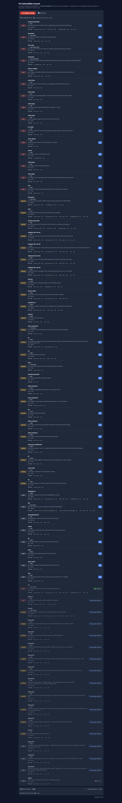
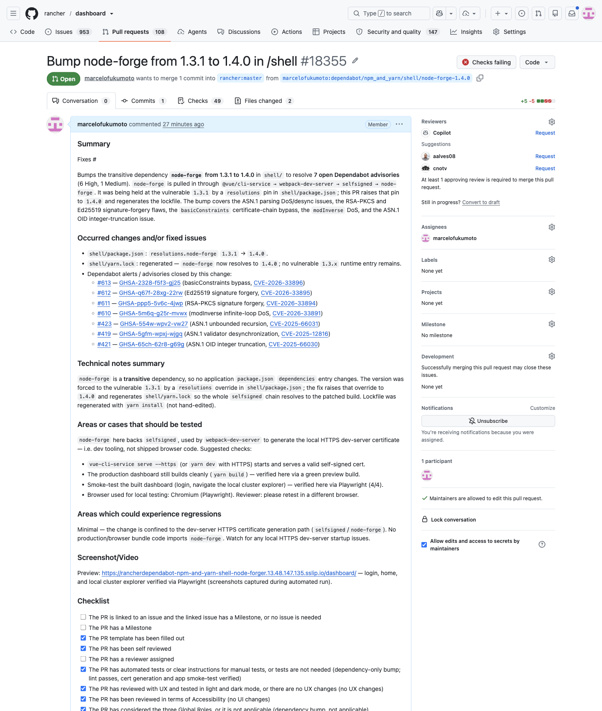

# Fix Vulnerability Console

> **Agentic > Autonomous build & deploy** demo in [AI Shared](../../../../README.md).

**Why:** Turn the Dependabot backlog into a one-click console — pick a vulnerability (or "Fix highest-severity") and an agent bumps it in a fork, deploys a preview, verifies it with Playwright, and drafts a PR, one at a time.

## The console: actionable vulnerabilities, one button each

**Why:** The list isn't just a report — every row is an action. The console fetches the live Dependabot state for `rancher/dashboard`, separates what's actually fixable from what already has a PR or has no fix, and puts a **Fix** button on each actionable one.

```
Build a console over the Dependabot vulnerabilities for rancher/dashboard.

- Fetch every alert; for each, resolve the fixed version(s) and the manifest/lock
  files affected (e.g. yarn.lock, shell/yarn.lock, storybook/yarn.lock).
- Bucket them: fixable, already has a Dependabot PR, no fix available.
- Render one row per vulnerability — severity, package, current → fixed version,
  advisory summary, affected files — each with a Fix button.
- Add a "Fix highest-severity" button that picks the top actionable one, and a
  Refresh that re-pulls the live state.
```

**Result:** 

## The fix: fork, preview, Playwright-verify, draft PR

**Why:** A version bump you haven't run is a guess. The agent doesn't just edit the lock file — it stands the app up in a preview and drives it with Playwright before it asks for review, so the PR arrives already known-good.

```
When a vulnerability is picked (or "Fix highest-severity"):

1. Bump the vulnerable dependency to the fixed version in a fork of
   rancher/dashboard, updating every affected lock file.
2. Deploy a preview environment for that branch.
3. Verify with Playwright: the app builds, loads, and the core flows still pass
   against the bumped dependency.
4. If it's green, draft a PR — the bump, the advisory it closes, and the
   Playwright result. If it fails, stop and report why instead of opening a PR.

One vulnerability at a time, so each fix is isolated and independently reviewable.
```

**Result:** 

## What to look for

- The list is actionable, not informational. This is the counterpart to the Security Alert Dashboards demo: that one shows the trend, this one *burns it down* — every row is a button that ends in a reviewable PR.
- Verified before review, not after. The Playwright pass on a deployed preview is the whole point — the PR isn't "here's a bump, hope it works", it's "here's a bump that still boots and passes the core flows".
- Fails honestly. A bump that breaks the build or the flows stops and reports; it never drafts a green-looking PR over a red preview.
- One at a time, isolated. Each fix is its own fork branch, preview, and PR, so a bad bump can't contaminate the others and review stays independent.
- Estimated time saved: triaging, bumping, running, and manually smoke-testing a security fix is 20–40 minutes each even when the bump is clean — and there are dozens. Here it's one click to a verified draft PR. Full breakdown in the impact.md file above.

## Skills & files

- [`impact.md`](files/impact.md)

## Notes

- Same lifecycle as the other build-and-deploy consoles (Screenshot Feedback, Extension Console): a console as the control surface, an agent that carries each item all the way to a deployed, browser-verified artifact.
- Pairs with two earlier Dependabot demos — the **Security Alert Dashboards** tool (visibility) and the **Dependabot Auto-Fixer** loop (the hard, un-auto-fixable alerts). This console is the one-click path for the straightforward, fixable ones.
- Keep it to a fork + draft PR — an agent that verifies in a preview is still not something you let push to a protected branch.
- Screenshots to add: `media/vuln-console.png` (the console, per the shared screenshot), `media/fix-pr.png` (a drafted PR with the Playwright result).
